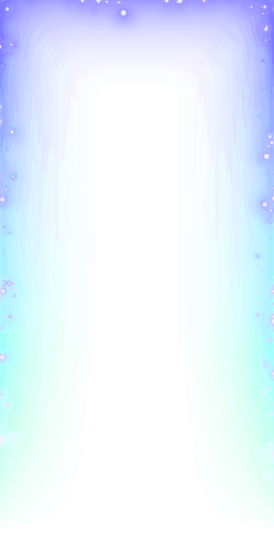
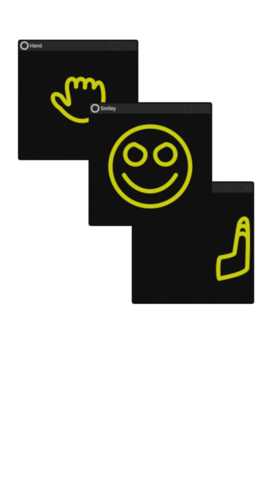

Custom profile effects marked as default profile effects<br>Down below you can find dropdown menu's for each effect, click on them to expand<br><br>Effects by [DTACat][dtacatgh]

<details open>
<summary>Available Effects</summary>

<details>
<summary>Doors Guiding Light</summary>

```
https://customeffects.github.io/DefaultEffects/Assets/DoorsGuidingLight.png
```

</details>

<details>
<summary>Smile</summary>

```
https://customeffects.github.io/DefaultEffects/Assets/Assets/Smile.gif
```


```
https://customeffects.github.io/DefaultEffects/Assets/Assets/Smile.png
```

</details>

[dtacatgh]: https://github.com/DTACat
